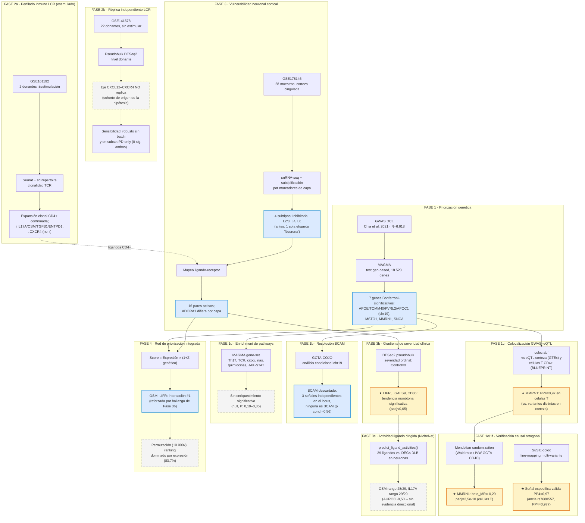

# Diagrama del pipeline — Decoding the Neuroimmune Synapse in LBD

Este documento resume, fase por fase, qué entra, qué método se aplica, qué sale y por qué importa. Para el detalle metodológico completo ver `MANUSCRIPT_Neuroimmune_Interactions_LBD.md`; para la implementación, `Snakefile` + `config/pipeline_config.yaml`.

**Leyenda:** azul = hallazgo confirmatorio/descriptivo; amarillo = hallazgo positivo nuevo de esta ronda de trabajo (los dos más fuertes del proyecto); gris punteado = resultado nulo (informativo, no un fallo).

---

## Tabla resumen: qué se obtuvo y por qué importa

| Fase | Input | Método | Resultado clave | Por qué es relevante |
|---|---|---|---|---|
| **1 — Priorización genética** | GWAS DCL (GCST90001390, N=6.618) | MAGMA, test gen-based, SNPs completos (no pre-filtrados) | 7 genes Bonferroni-significativos: locus APOE (PVRL2/APOE/TOMM40/APOC1), MSTO1, MMRN1, SNCA | Corrige un análisis previo subpotenciado (454 SNPs → 34 genes) que había señalado a BCAM como principal; establece la base genética real del estudio |
| **1b — Resolución BCAM** | Output de Fase 1, locus chr19 | GCTA-COJO, selección stepwise + condicionamiento conjunto | BCAM pierde toda significancia (p: 6,6×10⁻¹³ → 0,56) al condicionar sobre las 3 señales independientes reales del locus | Descarta formalmente una hipótesis mecanística previa con estadística de precisión, no solo sospecha de LD |
| **1c — Colocalización GWAS-eQTL** | Genes Bonferroni + receptores candidatos, eQTLs GTEx/BLUEPRINT (tabix remoto) | coloc.abf, dos tejidos (corteza vs. células T CD4+) | **MMRN1: PP4=0,97 en células T** (variante causal compartida) vs. PP3=0,78 en corteza (variantes distintas) | Primera evidencia de convergencia genética-inmune tejido-específica: el riesgo de MMRN1 actuaría vía expresión inmune, no neuronal — coherente con la hipótesis central del estudio |
| **1d — Enrichment de pathways** | Genes Bonferroni + gene-sets KEGG inmunes (pre-especificados) | MAGMA gene-set competitivo | Ningún pathway (Th17, TCR, citoquinas, quimiocinas, JAK-STAT) alcanza significancia | Resultado nulo honesto: no hay convergencia poligénica detectable a nivel de pathway con el poder actual — acota, no descarta, la hipótesis |
| **1e — Mendelian randomization** | Resultado de 1c (qué gen/tejido testear), instrumentos eQTL | Wald ratio (SNP líder) + IVW (3 SNPs GCTA-COJO para chr19) | **MMRN1 en células T: beta=-0,29, padj=2,5×10⁻¹⁰**; resto del panel sin instrumento testeable (p<1×10⁻⁵) en ningún tejido | Verifica causalmente el hallazgo de 1c con un método de supuestos distintos (no solo "consistente con", sino "genéticamente predicho asociado a menor riesgo") |
| **1f — SuSiE-coloc (fine-mapping)** | MMRN1, ventana ±200kb, LD de 1000G EUR | SuSiE por dataset + coloc.susie por credible set | El credible set anclado en rs7680557 (mismo SNP de 1c/1e) colocaliza a PP4=0,977 con un credible set eQTL específico; resto de combinaciones PP3≈1 | Confirma que el PP4=0,97 de 1c es una señal específica, no una mezcla espuria de las múltiples señales del locus |
| **2a — Perfilado inmune LCR** | GSE161192, 2 donantes ±estimulación | scRNA-seq+TCR-seq, Seurat+scRepertoire, DE Wilcoxon | Expansión clonal CD4+ confirmada; IL17A/OSM/TGFB1/ENTPD1 ↑ en clones expandidos; CXCR4 ↓ (no ↑) | Hallazgo más replicado del estudio; refuta el sentido de cambio de CXCR4 propuesto en la literatura original |
| **2b — Réplica independiente** | GSE141578, 22 donantes sin estimular (cohorte fuente de la hipótesis CXCR4) | Pseudobulk DESeq2 a nivel de donante, corregido por batch | Eje CXCL12–CXCR4 no replica (0-1 genes significativos de 13.575 testeados) | Prueba directa y bien powered de una hipótesis publicada, en la cohorte que la originó — no es solo ausencia de señal en datos débiles |
| **2c — Sensibilidad a batch** | Mismo pseudobulk de 2b | DESeq2 sin covariable de batch + subset PD-only | 0 genes significativos en ambos modelos alternativos (13.575 y 13.396 genes testeados) | La no-replicación de CXCL12–CXCR4 no depende de la decisión de ajuste por lote — descarta esa objeción de antemano |
| **3 — Vulnerabilidad neuronal cortical** | GSE178146, 28 muestras corteza cingulada anterior | snRNA-seq + subtipificación por marcadores de capa + mapeo ligando-receptor | 4 subtipos neuronales resueltos (antes: 1 sola etiqueta); 16 pares ligando-receptor activos; ADORA1 difiere entre capas | Habilita, por primera vez en este pipeline, cualquier afirmación con resolución de tipo celular en la corteza |
| **3b — Gradiente de severidad clínica** | Receptores activos de Fase 3, condición clínica de cada muestra | DESeq2 pseudobulk, severidad ordinal pre-especificada (Control<PD<PDD<DLB) | **LIFR, LGALS9, CD86: tendencia monótona significativa (padj<0,05)** con la severidad clínica | Upgradea receptores candidatos de "una comparación aislada" a "gradiente estadísticamente robusto" — aunque ver 3c para la interpretación mecanística de LIFR específicamente |
| **3c — Actividad ligando dirigida** | 29 ligandos candidatos de Fase 2a, DEGs DLB en neuronas ACC | NicheNet `predict_ligand_activities()` (entorno conda aislado) | **OSM rango 28/29, IL17A rango 29/29 (AUROC~0,50-0,51)** — sin evidencia de actividad dirigida | Revierte la interpretación mecanística de OSM–LIFR como eje causal; el gradiente de LIFR (3b) se mantiene, pero no se puede atribuir a OSM |
| **4 — Red de priorización integrada** | Fase 1 (Z genético) + Fase 3 (expresión) | Score heurístico = Expresión × (1+max(0,Z)) — explícitamente no causal | OSM–LIFR como interacción mejor priorizada por expresión | Integra las dos capas de datos; Fase 3c muestra que este ranking por expresión no coincide con el ranking por actividad dirigida — ambos análisis miden cosas distintas y legítimas, no deben confundirse |
| **4b — Verificación por permutación** | Red de Fase 4 | Permutación de Z-estadísticos entre receptores (10.000x) | OSM–LIFR se mantiene #1 en 83,7% de permutaciones; correlación con ranking por expresión pura = 0,956 | Cuantifica, en vez de solo afirmar, que el ranking está dominado por expresión — convierte una limitación declarada en un número verificable |

---

## Cómo se conecta todo (resumen narrativo)

1. **Genética (1 → 1b → 1c → 1d):** de un análisis subpotenciado que apuntaba a un gen equivocado (BCAM), se llega a una lista de 7 genes de riesgo genuinos, se descarta formalmente el gen equivocado, y se prueba si ese riesgo converge con expresión génica — en corteza no, pero **en células T sí, para MMRN1**.
2. **Inmunología (2a → 2b):** se confirma el hallazgo más sólido del estudio (expansión clonal CD4+) en dos cohortes, y se refuta específicamente el mecanismo de tráfico celular (CXCL12–CXCR4) propuesto en la publicación original, usando la cohorte que generó esa hipótesis.
3. **Neurociencia (3 → 3b → 3c):** se resuelve por primera vez la heterogeneidad neuronal cortical, se mapean interacciones candidatas, se muestra que tres receptores **escalan con la severidad clínica**, y luego un análisis direccional (NicheNet) revierte específicamente la interpretación mecanística de OSM como impulsor de esa señal — el gradiente de LIFR es real, su atribución a OSM no lo es.
4. **Integración (4 → 4b):** la red de priorización por expresión ubica a OSM–LIFR primero, pero la verificación por permutación muestra que ese ranking está dominado por expresión, no por genética — coherente con que el mismo par no destaque en el análisis direccional de 3c. Las tres fases (4, 4b, 3c) juntas dan una imagen más completa que cualquiera por separado: expresión alta, sin respaldo genético, sin evidencia direccional.
